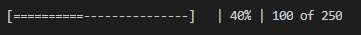
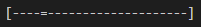

# Progress indicator
Indicadores de progreso implementados en node.js para línea de comandos.

Los tipos de indicadores implementados son:
1. Barra de progreso
2. Barra de progreso indeterminado
3. Throbber

<<<<<<< HEAD

## Barra de progreso

## Barra de progreso indeterminado 

## Throbber

=======

>>>>>>> 2345aca83ba0c7fbb66120b030ce4c435647b57d
